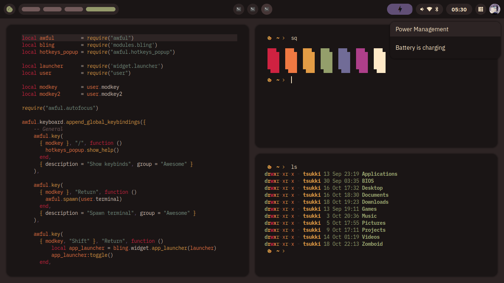
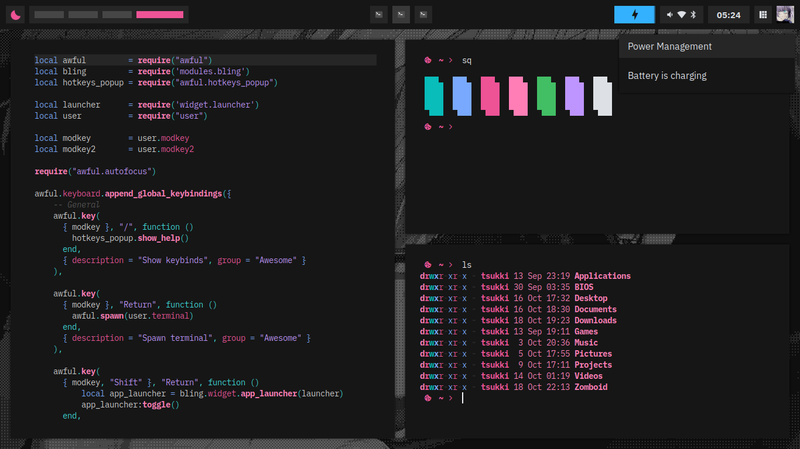
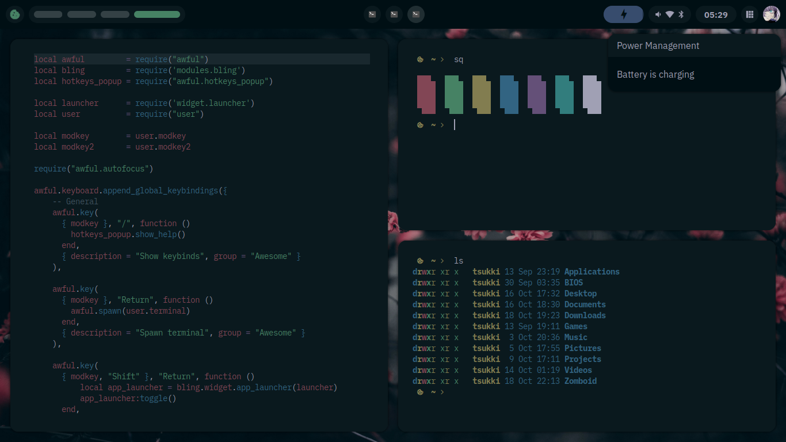

# Tsukiyomi

An elegant AwesomeWM configuration focused on beauty. Comes with a carefully crafted UI, three colorschemes, and a couple of variables to tweak the interface to the user's likings. A WIP currently. You can see this repo as a hybrid between dotfiles and an AWM configuration, but it should be modular enough to only pick what you really plan to use.

> __WARNING__: This configuration was not tested on other machines or OS's outside of mine, my code is also not perfect, since this is my first real attempt at AWM, the code may or may not work on your end, some things here need manual tweaking and errors may occur, procceed at your own caution, you've been warned.

---

### Dependencies

- [awesome-git](https://github.com/awesomeWM/awesome)
- [rubato](https://github.com/andOrlando/rubato)
- [bling](https://blingcorp.github.io/bling/)

- `picom`
- `mpd`, `mpc`
- `bluez`
- `maim`, `xclip`, `slop`

- `IBM Plex Sans`
- `Pipewire` and `Wireplumber`

Your suite of apps can be swapped out with relative ease, but if you want to use exactly what i have, you'll need thunar, [siduck's build of st](https://github.com/siduck/st), [my custom neovim configuration](https://github.com/tsukki9696/totsuka), firefox, and ncmpcpp for a music player.

---

### Features

Tsukiyomi has a powerful user configuration in which you can tweak things like:
- Colorscheme
- Suite of apps
- Font and icon theme
- UI elements (gaps, spacing, borders)
- Toggleable UI elements and signals
- Accent color
- Layouts and tags
- Wallpaper, avatar, home icon
- Vertical bar
- Titlebars
- Modkeys

And other aspects can also be tweaked outside of user configuration, like keybinds and scratchpads.

---

### File structure

- `assets`: images and svgs
- `base`: keybinds, autostart, scratchpad config
- `modules`: external libraries
- `signals`: for awm signals
- `theme`: theme variables and colorschemes
- `widget`: bar, launcher, notifications, titlebar config and others

- `helpers.lua`: helper functions
- `user.lua`: user configuration
- `rc.lua`: file that loads everything

---

### Keybinds

- `Super + Return` opens a terminal.
- `Super + /` shows the keybinds.

---

### TODO

- Control center widget
- Dock widget
- More complex screenshot signals
- Better keybinds popup
- Theme switcher
- Preset colorscheme-matching wallpapers
- Overall cleanup of code

---

### Gallery

<b>Colorschemes</b>

### Biscuit

### Oxocarbon

### Sakura

---

### Credits

- Stardust kyun's [Sakura dotfiles](https://github.com/Stardust-kyun/dotfiles) and support, since they gave me the courage needed to tackle this project and also some sweet reference for how to do things, also the nice colorscheme
- Gwynsav's gwdawful and [gwileful](https://github.com/Gwynsav/gwileful) rices, from which I borrowed some code, widgets and insight on how to execute ideas
- Chadcat's [Crystal](https://github.com/chadcat7/crystal) rice, for the battery widget
- The [Unixporn discord server](https://discord.gg/unixporn) for a lot of insight and troubleshooting
- Nyoom for the [oxocarbon](https://github.com/nyoom-engineering/oxocarbon/tree/main) colorscheme
- My mom, she's very cool
